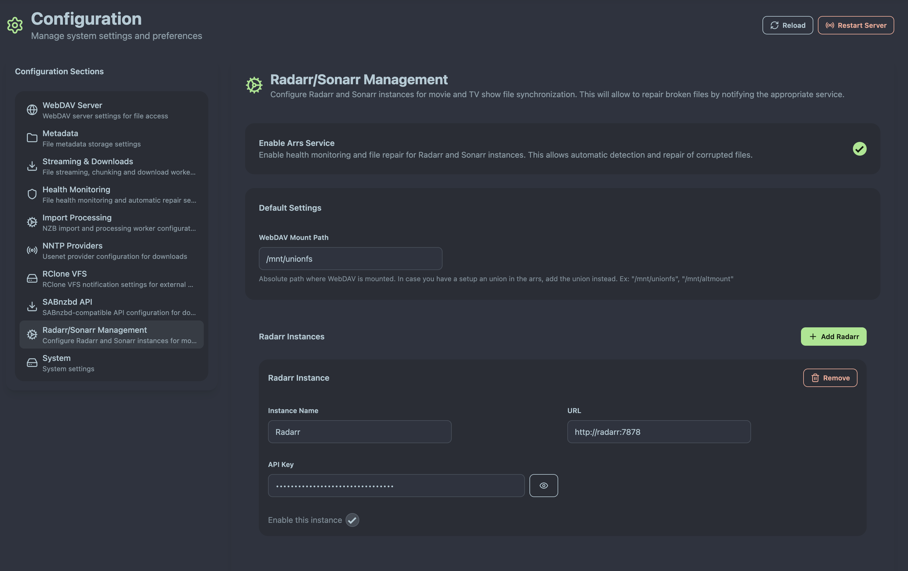

# Basic Configuration

This guide covers the essential configuration settings to get AltMount up and running with your setup. AltMount provides a comprehensive web interface for all configuration, but understanding the core concepts helps ensure optimal setup.

## Configuration Overview

AltMount uses both a YAML configuration file and a web interface for configuration management. The essential configuration areas are:

- **WebDAV**: Server settings and user authentication
- **Metadata Storage**: Where imported files are permanently stored (portable for backups)
- **NNTP Providers**: Multiple Usenet provider connections with automatic failover
- **Health Monitoring**: Automatic corruption detection and repair coordination
- **ARR Integration**: Radarr/Sonarr integration with proper mount path configuration
- **SABnzbd Compatibility**: Drop-in replacement for existing workflows
- **RClone VFS**: Cache notification support for mounted storage

## Configuration via Web Interface

AltMount provides a comprehensive web interface for all configuration needs:


_AltMount system configuration interface showing all major settings_

**Essential Configuration Requirements:**

- **Metadata storage**: Directory for storing file metadata (configured in System settings)
- **At least one NNTP provider**: Configured in the Providers section
- **WebDAV settings**: Port and authentication (optional but recommended)

## Core Configuration Sections

### WebDAV Server Settings

Configure the WebDAV server through the System Configuration interface:


_WebDAV settings in the system configuration panel_

**WebDAV Configuration Options:**

- **Port**: The port AltMount listens on (default: 8080)
- **Username & Password**: Credentials for WebDAV authentication (recommended for security)

**WebDAV Authentication:**

WebDAV authentication uses simple username/password credentials that protect access to your content:

```yaml
webdav:
  port: 8080
  user: "usenet" # Your chosen username
  password: "usenet" # Your secure password
  debug: false
```

**Security Recommendations:**

- **Always set authentication credentials** - leaving WebDAV open is a security risk
- **Use strong, unique passwords** - avoid default credentials like "usenet/usenet"
- **Consider reverse proxy with SSL** for external access and HTTPS encryption
- **Keep debug mode disabled in production** to reduce log verbosity

**Media Client Configuration:**

When configuring media clients (Plex, Jellyfin, etc.), use these WebDAV credentials:

- **Server**: `http://altmount-server:8080`
- **Username**: Your configured WebDAV username
- **Password**: Your configured WebDAV password

### Metadata Storage

Metadata storage configuration is available in the System settings:


_Metadata storage settings in the system configuration_

**Metadata Storage - Your Portable File Archive:**

The metadata directory is where AltMount stores **all imported files permanently**. This directory contains your actual media files, not just metadata:

```yaml
metadata:
  root_path: "./metadata" # Directory for permanent file storage
```

**Key Benefits:**

- **Portable Backup**: Copy the entire metadata folder to backup all imported content
- **Instance Migration**: Transfer the metadata folder to move your entire collection to another AltMount instance
- **Permanent Storage**: Once files are imported, they remain available even if original NZB sources become unavailable
- **Direct Access**: Files are stored as normal filesystem files, accessible outside AltMount

**Storage Requirements:**

- **Root Path**: Directory where AltMount stores all imported files (required)
- **Permissions**: Must be writable by the AltMount process
- **Storage Type**: Fast storage (SSD) recommended for optimal performance
- **Space Planning**: Plan for full size of imported media content

:::warning Critical Setting
The metadata root_path is **required** and essential for AltMount operation. This directory will contain your entire imported media collection.
:::

**Directory Structure:**

```
metadata/
├── movies/
│   ├── Movie.Title.2023.1080p.BluRay.x264/
│   │   ├── Movie.Title.2023.1080p.BluRay.x264.mkv
│   │   └── subs/
│   └── Another.Movie.2023.2160p.UHD.BluRay.x265/
├── tv/
│   └── TV.Show.S01E01.1080p.WEB-DL.x264/
│       ├── TV.Show.S01E01.1080p.WEB-DL.x264.mkv
│       └── subtitles/
└── downloads/
    └── [active-processing]
```

**Backup Strategy:**

Simply copy the metadata directory to backup your entire collection:

```bash
# Backup entire collection
rsync -av ./metadata/ /backup/location/metadata/

# Restore to new AltMount instance
rsync -av /backup/location/metadata/ ./metadata/
```

### NNTP Providers

NNTP providers are configured through the Providers interface in the web UI. You can add multiple providers for redundancy and performance:

**Provider Strategy:**

- **Multiple Providers**: Add as many providers as you want for better reliability
- **Load Distribution**: Connections are used based on provider order and availability
- **Missing Article Failover**: All other providers are checked when articles are missing
- **Backup Providers**: Designated backup providers only used when primary providers fail

**Configuration Access:**

Navigate to the Providers section in the web interface to add and manage your NNTP providers. See [NNTP Providers Configuration](providers.md) for detailed setup instructions.

### Health Monitoring

Health monitoring automatically detects corrupted files and can coordinate repairs:

**Health Monitoring Features:**


- **Corruption Detection**: Automatically logs corrupted files during playback or access
- **Repair Coordination**: When auto-repair is enabled, notifies ARRs to re-download corrupted content
- **ARR Integration**: Requires configured ARR instances for automatic repair functionality

```yaml
health:
  enabled: true # Enable health monitoring service
  auto_repair_enabled: false # Enable automatic repair via ARRs
```

**Default Behavior**: Health monitoring only logs corrupted files. Enable auto-repair only if you have ARR instances configured.

See [Health Monitoring Configuration](health-monitoring.md) for complete setup details.

### RClone VFS Integration


RClone VFS integration helps notify RClone when files change, preventing import failures:

```yaml
rclone:
  vfs_enabled: false # Enable VFS notifications
  vfs_url: "http://localhost:5572" # RClone VFS URL
  vfs_user: "" # VFS authentication (optional)
  vfs_pass: "" # VFS authentication (optional)
```

**When to Enable RClone VFS:**

- **Cache Enabled**: If you have RClone cache enabled, AltMount can notify RClone of file changes
- **ARR Import Issues**: If Sonarr/Radarr imports fail due to cache staleness
- **Mounted Storage**: When AltMount metadata directory is on RClone-mounted storage

Without VFS notification, ARR imports may fail if RClone cache hasn't refreshed to show newly imported files.

### SABnzbd Compatibility

AltMount can act as a drop-in replacement for SABnzbd:


```yaml
sabnzbd:
  enabled: false # Enable SABnzbd-compatible API
  mount_dir: "/mnt/altmount" # Directory where WebDAV is mounted
```

**Integration Workflow:**

1. **ARR Configuration**: Add AltMount as SABnzbd downloader in your ARRs
2. **NZB Reception**: AltMount receives NZB from ARR, imports it
3. **Completion Notification**: ARR picks up the completed download
4. **Mount Directory**: Must be configured from the mounted directory point of view (where ARRs see the files)

**Critical Configuration**: The `mount_dir` must be set to the path where your ARRs see the WebDAV-mounted files, not the local AltMount path.

See [SABnzbd Integration](sabnzbd.md) for complete setup instructions.

### ARR Integration

Configure ARR instances for automatic repair and integration:

**ARR Instance Requirements:**

- **Mount Path**: The path where ARRs see the WebDAV mount - must match across all ARR instances
- **API Credentials**: Valid API keys for each ARR instance
- **Network Access**: ARRs must be able to reach AltMount WebDAV server



```yaml
arrs:
  enabled: false # Enable ARRs service
  mount_path: "/mnt/altmount" # WebDAV mount path (from ARR perspective)
```

**Mount Path Configuration**: This is the most critical setting - it must be the same path your ARRs use to access the WebDAV-mounted AltMount content.

See [ARR Integration](integration.md) for detailed configuration and mount path setup.

## Next Steps

With basic configuration complete, you can:

1. **[Configure NNTP Providers](providers.md)** - Add your Usenet providers
2. **[Set up ARR Integration](integration.md)** - Connect Radarr, Sonarr, etc.
3. **[Configure Advanced Settings](advanced.md)** - Fine-tune performance and features
4. **[Start Using WebDAV](../usage/webdav-clients.md)** - Connect your media applications

## Configuration Reference

For complete configuration options, see:

- [NNTP Providers](providers.md) - Usenet provider configuration
- [WebDAV Settings](webdav.md) - WebDAV server options
- [Streaming Options](streaming.md) - Performance and streaming settings
- [ARR Integration](integration.md) - Radarr/Sonarr setup
- [Advanced Configuration](advanced.md) - All configuration options
