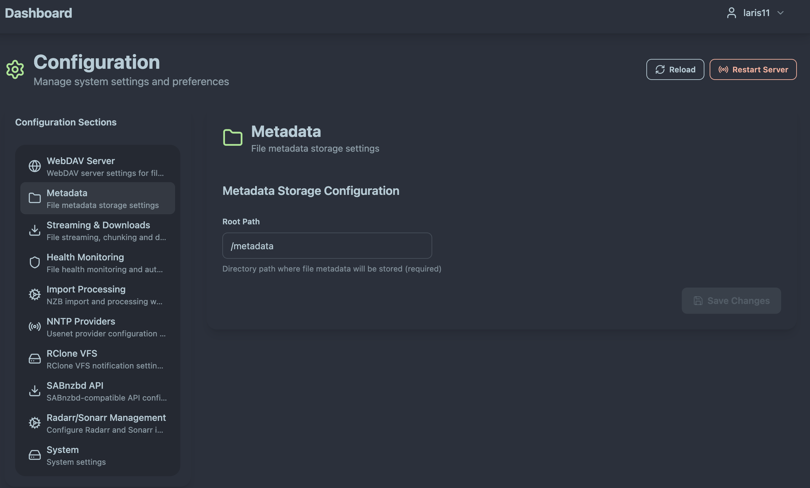
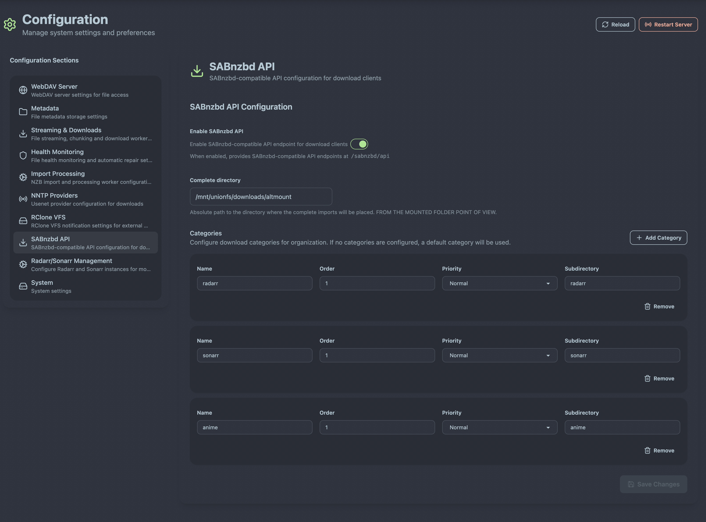

# Basic Configuration

This guide covers the essential configuration settings to get AltMount up and running with your setup. AltMount provides a comprehensive web interface for all configuration, but understanding the core concepts helps ensure optimal setup.

## Configuration Overview

AltMount uses both a YAML configuration file and a web interface for configuration management. The essential configuration areas are:

- **WebDAV**: Server settings and user authentication
- **Metadata Storage**: Where imported files are permanently stored (portable for backups)
- **NNTP Providers**: Multiple Usenet provider connections with automatic failover
- **Health Monitoring**: Automatic corruption detection and repair coordination
- **ARR Integration**: Radarr/Sonarr integration with proper mount path configuration
- **SABnzbd Compatibility**: Drop-in replacement for existing workflows
- **RClone VFS**: Cache notification support for mounted storage

## Configuration via Web Interface

AltMount provides a comprehensive web interface for all configuration needs:


_AltMount system configuration interface showing all major settings_

**Essential Configuration Requirements:**

- **Metadata storage**: Directory for storing file metadata (configured in System settings)
- **At least one NNTP provider**: Configured in the Providers section
- **WebDAV settings**: Port and authentication (optional but recommended)

## Core Configuration Sections

### WebDAV Server Settings

Configure the WebDAV server through the System Configuration interface:


_WebDAV settings in the system configuration panel_

**WebDAV Configuration Options:**

- **Port**: The port AltMount listens on (default: 8080)
- **Username & Password**: Credentials for WebDAV authentication (recommended for security)

**WebDAV Authentication:**

WebDAV authentication uses simple username/password credentials that protect access to your content:

```yaml
webdav:
  port: 8080
  user: "usenet" # Your chosen username
  password: "usenet" # Your secure password
  debug: false
```

**Security Recommendations:**

- **Always set authentication credentials** - leaving WebDAV open is a security risk
- **Use strong, unique passwords** - avoid default credentials like "usenet/usenet"
- **Consider reverse proxy with SSL** for external access and HTTPS encryption
- **Keep debug mode disabled in production** to reduce log verbosity

**Media Client Configuration:**

When configuring media clients (Plex, Jellyfin, etc.), use these WebDAV credentials:

- **Server**: `http://altmount-server:8080/webdav`
- **Username**: Your configured WebDAV username
- **Password**: Your configured WebDAV password

### Metadata Storage

Metadata storage configuration is available in the System settings:


_Metadata storage settings in the system configuration_

**Metadata Storage - Your Portable File Archive:**

The metadata directory is where AltMount stores **all imported files permanently**. This directory only contains the metadata files, not the actual media files:

```yaml
metadata:
  root_path: "./metadata" # Directory for permanent file storage
```

**Key Benefits:**

- **Portable Backup**: Copy the entire metadata folder to backup all imported content
- **Instance Migration**: Transfer the metadata folder to move your entire collection to another AltMount instance
- **Permanent Storage**: Once files are imported, they remain available even if original NZB sources become unavailable
- **Direct Access**: Files are stored as normal filesystem files, accessible outside AltMount

**Storage Requirements:**

- **Root Path**: Directory where AltMount stores all imported files (required)
- **Permissions**: Must be writable by the AltMount process
- **Storage Type**: Fast storage (SSD) recommended for optimal performance
- **Space Planning**: Plan for full size of imported media content

:::warning Critical Setting
The metadata root_path is **required** and essential for AltMount operation. This directory will contain your entire imported media collection.
:::

**Directory Structure:**

```
metadata/
├── movies/
│   ├── Movie.Title.2023.1080p.BluRay.x264/
│   │   ├── Movie.Title.2023.1080p.BluRay.x264.mkv
│   │   └── subs/
│   └── Another.Movie.2023.2160p.UHD.BluRay.x265/
├── tv/
│   └── TV.Show.S01E01.1080p.WEB-DL.x264/
│       ├── TV.Show.S01E01.1080p.WEB-DL.x264.mkv
│       └── subtitles/
└── downloads/
    └── [active-processing]
```

**Backup Strategy:**

Simply copy the metadata directory to backup your entire collection:

```bash
# Backup entire collection
rsync -av ./metadata/ /backup/location/metadata/

# Restore to new AltMount instance
rsync -av /backup/location/metadata/ ./metadata/
```

### NNTP Providers

NNTP providers are configured through the Providers interface in the web UI. You can add multiple providers for redundancy and performance:

**Provider Strategy:**

- **Multiple Providers**: Add as many providers as you want for better reliability
- **Load Distribution**: Connections are used based on provider order and availability
- **Missing Article Failover**: All other providers are checked when articles are missing
- **Backup Providers**: Designated backup providers only used when primary providers fail

**Configuration Access:**

Navigate to the Providers section in the web interface to add and manage your NNTP providers. See [NNTP Providers Configuration](providers.md) for detailed setup instructions.

### Health Monitoring

Health monitoring automatically detects corrupted files and can coordinate repairs:

**Health Monitoring Features:**


- **Corruption Detection**: Automatically logs corrupted files during playback or access
- **Repair Coordination**: When auto-repair is enabled, notifies ARRs to re-download corrupted content
- **ARR Integration**: Requires configured ARR instances for automatic repair functionality

```yaml
health:
  enabled: true # Enable health monitoring service
  auto_repair_enabled: false # Enable automatic repair via ARRs
```

**Default Behavior**: Health monitoring only logs corrupted files. Enable auto-repair only if you have ARR instances configured.

See [Health Monitoring Configuration](health-monitoring.md) for complete setup details.

### RClone Built-in Mount

AltMount includes a built-in rclone mount feature that mounts the WebDAV interface as a local filesystem:


_RClone mount configuration interface showing all mount settings_

**RClone Mount Configuration:**

```yaml
rclone:
  # Mount Configuration
  mount_enabled: true           # Enable/disable the built-in rclone mount
  path: "/mnt/altmount"        # Mount path (where WebDAV will be mounted)

  # Remote Control (RC) Configuration
  rc_enabled: true              # Enable rclone RC server for cache management
  rc_url: ""                    # RC server URL (auto-configured if empty)
  rc_port: 5572                 # RC server port
  rc_user: "admin"              # RC authentication username
  rc_pass: "admin"              # RC authentication password

  # VFS Cache Settings
  cache_dir: "/cache"           # Cache directory location
  vfs_cache_mode: "full"        # Cache mode: off, minimal, writes, full
  vfs_cache_max_size: "50G"     # Maximum cache size
  vfs_cache_max_age: "300m"     # Maximum cache age (5 hours)
  vfs_read_chunk_size: "32M"    # Chunk size for reading
  vfs_read_ahead: "128k"        # Read-ahead buffer size
  dir_cache_time: "5m"          # Directory cache time

  # Performance Settings
  buffer_size: "10M"            # Buffer size for operations
  transfers: 4                  # Number of parallel transfers
  async_read: true              # Enable async reading

  # Mount-Specific Settings
  allow_other: true             # Allow other users to access mount
  allow_non_empty: true         # Allow mounting over non-empty directory
  read_only: false              # Mount as read-only
  timeout: "10m"                # I/O operation timeout
  syslog: true                  # Send logs to syslog

  # Advanced Settings
  no_mod_time: false            # Disable modification time updates
  no_checksum: false            # Disable checksum verification
  vfs_fast_fingerprint: false   # Use fast fingerprinting
  use_mmap: false               # Use memory-mapped I/O
```

**Key Configuration Options:**

- **mount_enabled**: Toggle to enable/disable the built-in mount
- **path**: Where the WebDAV interface will be mounted on the filesystem
- **vfs_cache_mode**:
  - `off`: No caching
  - `minimal`: Cache file structure only
  - `writes`: Cache writes, stream reads
  - `full`: Cache everything (recommended for media streaming)
- **vfs_cache_max_size**: Limit cache size to prevent disk space issues
- **rc_enabled**: Enable remote control server for cache management and operations

**When to Use Built-in RClone Mount:**

- **ARR Integration**: Required for ARR applications to access imported files via filesystem
- **Direct File Access**: Provides filesystem access to WebDAV content
- **Cache Management**: RC server enables cache notifications and management
- **Performance**: Full cache mode provides best streaming performance

### WebDAV Mount Path

The mount path tells AltMount where ARR applications access the WebDAV-mounted content:

```yaml
mount_path: "/mnt/altmount" # Path where ARRs see the WebDAV mount
```

**Critical Configuration:**

This is the **most important setting for ARR integration**. It must match exactly where your ARR applications access the WebDAV mount:

- **Not the metadata path**: Don't use AltMount's internal metadata directory
- **Not the docker volume path**: Don't use the Docker internal path
- **ARR's perspective**: Use the actual filesystem path where ARRs see the mount

**Deployment Examples:**

| Deployment | mount_path Value | ARR Library Path | Notes |
|------------|------------------|------------------|-------|
| Docker Compose | `/downloads` | `/downloads/movies/` | Shared volume mount between containers |
| Linux + rclone | `/mnt/altmount` | `/mnt/altmount/movies/` | Direct rclone WebDAV mount |
| Built-in Mount | `/mnt/altmount` | `/mnt/altmount/movies/` | Using AltMount's built-in rclone mount |

**Why Mount Path Matters:**

When health monitoring detects corrupted files, AltMount reports file paths to ARR applications for repair. If the mount path is wrong, ARRs cannot locate the files:

```
❌ Wrong: mount_path="/config/metadata" (AltMount internal path)
✅ Correct: mount_path="/mnt/altmount" (ARR's WebDAV mount path)
```

### SABnzbd Compatibility

AltMount can act as a drop-in replacement for SABnzbd:



```yaml
sabnzbd:
  enabled: false # Enable SABnzbd-compatible API
  complete_dir: "/mnt/altmount/completed" # The complete directory where the files will be imported from the WebDAV mount POINT OF VIEW
```

**Integration Workflow:**

1. **ARR Configuration**: Add AltMount as SABnzbd downloader in your ARRs
2. **NZB Reception**: AltMount receives NZB from ARR, imports it
3. **Completion Notification**: ARR picks up the completed download
4. **Complete Directory**: Must be configured from the mounted directory point of view (where ARRs see the files)

**Critical Configuration**: The `complete_dir` must be set to the path where your ARRs see the WebDAV-mounted files, not the local AltMount path.

See [SABnzbd Integration](integration.md) for complete setup instructions.

### ARR Integration

Configure ARR instances for automatic repair and health monitoring integration:


_ARR integration settings showing Radarr and Sonarr instance configuration_

**ARR Configuration:**

```yaml
arrs:
  enabled: true                # Enable ARR integration
  max_workers: 5               # Max concurrent repair operations

  radarr_instances:
    - name: "radarr-main"      # Descriptive name
      url: "http://localhost:7878"
      api_key: "your-api-key"
      enabled: true
      sync_interval_hours: 24  # Optional: hours between syncs (null = disabled)

  sonarr_instances:
    - name: "sonarr-main"
      url: "http://localhost:8989"
      api_key: "your-api-key"
      enabled: true
      sync_interval_hours: null # Null disables periodic sync
```

**Configuration Options:**

- **enabled**: Master toggle for ARR integration
- **max_workers**: Number of concurrent health check/repair operations
- **radarr_instances/sonarr_instances**: List of ARR instances to integrate
  - **name**: Descriptive identifier for the instance
  - **url**: Full URL to the ARR application
  - **api_key**: API key from ARR Settings → General
  - **enabled**: Toggle to enable/disable specific instance
  - **sync_interval_hours**: Hours between automatic syncs (null = disabled)

**Requirements:**

- **API Access**: Valid API keys for each ARR instance
- **Network Connectivity**: ARRs must be able to reach AltMount server
- **Mount Path**: Root-level `mount_path` must be configured (see WebDAV Mount Path section)

See [ARR Integration](integration.md) for detailed configuration and troubleshooting.

## Next Steps

With basic configuration complete, you can:

1. **[Configure NNTP Providers](providers.md)** - Add your Usenet providers
2. **[Set up ARR Integration](integration.md)** - Connect Radarr, Sonarr, etc.

## Configuration Reference

For complete configuration options, see:

- [NNTP Providers](providers.md) - Usenet provider configuration
- [Streaming Options](streaming.md) - Performance and streaming settings
- [ARR Integration](integration.md) - Radarr/Sonarr setup
