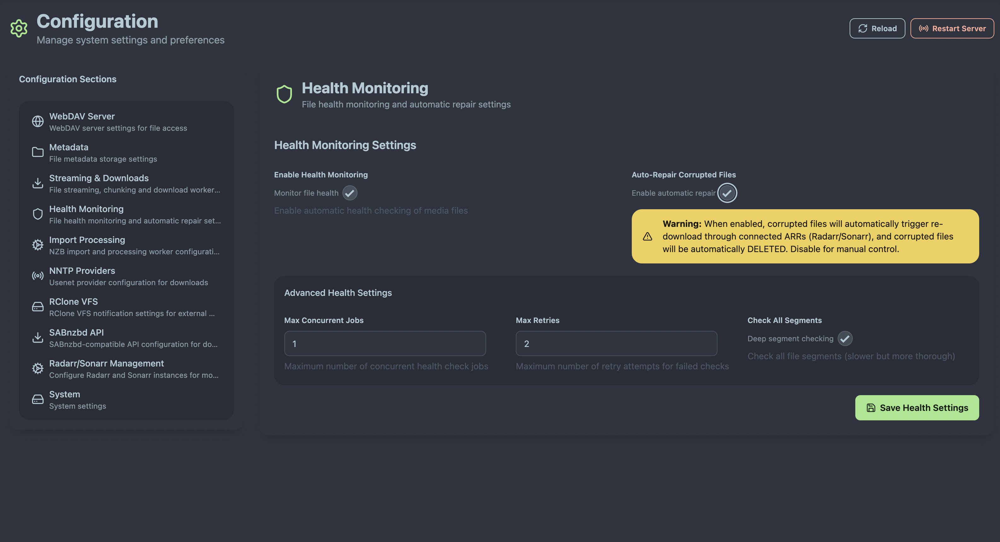
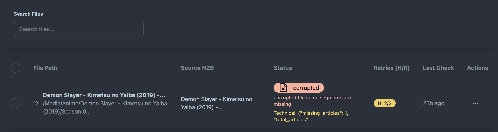
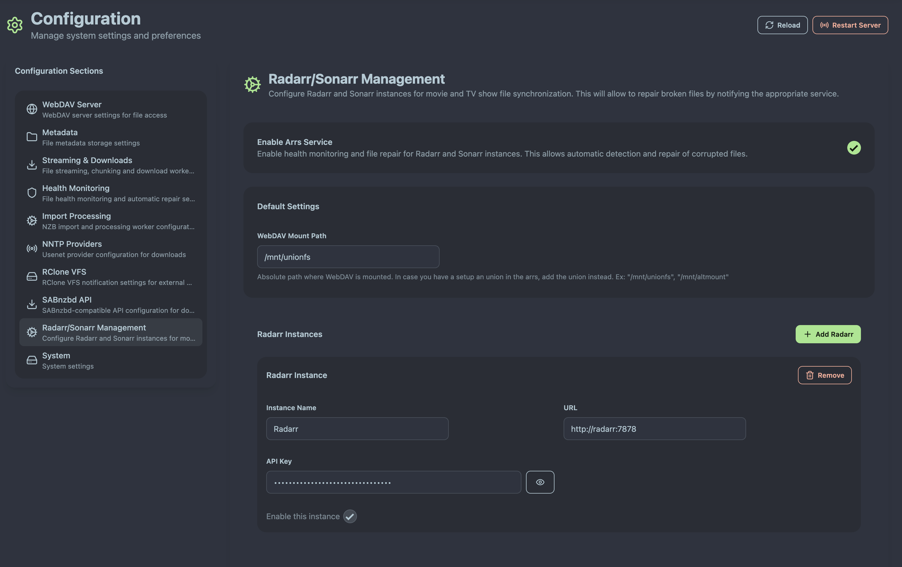

# Health Monitoring Configuration

AltMount provides comprehensive health monitoring capabilities that detect corrupted files and can automatically coordinate repairs through your ARR applications. This guide covers configuring health monitoring for optimal media collection integrity.

## Overview

AltMount's health monitoring system continuously watches for file corruption and integrity issues across your media collection. When issues are detected, AltMount can automatically notify your ARR applications to re-download the affected content.

## Basic Health Monitoring Configuration

### Core Health Settings

Configure health monitoring through the System Configuration interface:



```yaml
health:
  enabled: true # Enable health monitoring service
  auto_repair_enabled: false # Enable automatic repair via ARRs (default: false)
```

**Health Monitoring Components:**

- **Corruption Detection**: Monitors file access and playback for corruption indicators
- **Integrity Validation**: Checks file completeness and consistency
- **Repair Coordination**: Interfaces with ARR applications for automatic re-downloads
- **Status Reporting**: Provides health status through API and web interface

## Health Monitoring Behavior

### Default Configuration (Logging Only)

By default, AltMount health monitoring only logs corrupted files without taking action:

**Default Behavior:**

- ✅ **Corruption Detection**: Identifies and logs corrupted files
- ✅ **Status Tracking**: Maintains health status in database
- ✅ **API Reporting**: Provides health information via REST API
- ❌ **Automatic Repair**: Does not trigger re-downloads (disabled by default)

**Log Example:**

```
WARN Health monitor detected corrupted file: /metadata/movies/Movie.2023.1080p/Movie.2023.1080p.mkv
INFO Health status updated for: Movie.2023.1080p
```

This conservative approach prevents unwanted re-downloads while still providing visibility into collection health.

### Auto-Repair Configuration

Enable automatic repair only when you have ARR instances configured:

```yaml
health:
  enabled: true
  auto_repair_enabled: true # Enable automatic repair
```

**Auto-Repair Requirements:**

1. **ARR Integration Enabled**: Must have `arrs.enabled: true`
2. **ARR Instances Configured**: At least one Radarr or Sonarr instance
3. **Mount Path Configured**: Proper ARR mount path configuration
4. **API Access**: Valid API keys for ARR instances

### Health Status Dashboard

Monitor the health of your collection through the web interface:


_Health status overview showing collection integrity metrics_

**Health Dashboard Features:**

- **Overall Health Score**: Percentage of healthy files in collection
- **Recent Issues**: List of recently detected corrupted files
- **Repair Activity**: Status of automatic repair operations
- **Historical Trends**: Health metrics over time

## ARR Integration Requirements

### Enabling ARR Integration for Health Monitoring



Auto-repair requires properly configured ARR integration:

```yaml
arrs:
  enabled: true # Required for auto-repair
  mount_path: "/mnt/altmount" # Must match ARR WebDAV mount path
  radarr_instances:
    - name: "radarr-main"
      url: "http://localhost:7878"
      api_key: "your-radarr-api-key"
      enabled: true
  sonarr_instances:
    - name: "sonarr-main"
      url: "http://localhost:8989"
      api_key: "your-sonarr-api-key"
      enabled: true
```

### Critical ARR Configuration

**Mount Path Alignment:**

The ARR `mount_path` must exactly match where your ARRs access the WebDAV mount:

- **AltMount Mount Path**: `/mnt/altmount` (where ARRs see WebDAV files)
- **ARR Library Paths**: Must be under `/mnt/altmount/`
- **Consistency**: All ARR instances must use the same mount path

**Example ARR Configuration:**

```yaml
# Radarr library configuration
Movies Library Path: /mnt/altmount/movies/

# Sonarr library configuration
TV Shows Library Path: /mnt/altmount/tv/
```

## Health Monitoring Features

### Corruption Detection Methods

AltMount detects file corruption through multiple methods:

**Active Detection:**

- **Missing Articles**: Articles missing from the file
- **Playback Issues**: Detection of unplayable or damaged files

### Repair Process

When auto-repair is enabled and corruption is detected:

**Repair Workflow:**

1. **Corruption Detection**: Health monitor identifies corrupted file
2. **Content Identification**: Matches file to movie/TV show in ARR
3. **File Removal**: Removes the file from the library
4. **ARR Notification**: Sends re-download request to appropriate ARR
5. **Re-download Monitoring**: Tracks ARR re-download progress
6. **File Import**: ARR Imports the file into the library
7. **Altmount Import**: AltMount Imports the file into the metadata and replaces the old file

## Next Steps

With health monitoring configured:

1. **[Configure ARR Integration](integration.md)** - Set up Radarr/Sonarr integration
2. **[Monitor Health Dashboard](../usage/health-monitoring.md)** - Learn to use health monitoring features
3. **[Troubleshooting](../troubleshooting/common-issues.md)** - Resolve health monitoring issues

---

Health monitoring ensures your media collection remains intact and automatically repairs issues when they're detected. Start with logging-only mode and gradually enable auto-repair as you become comfortable with the system.
