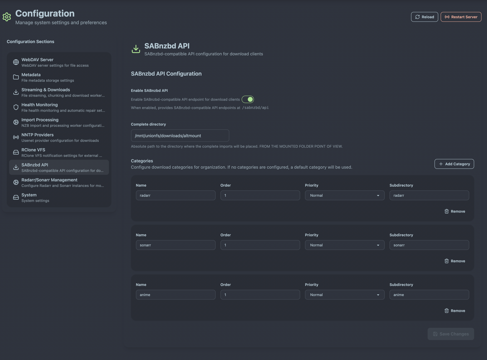
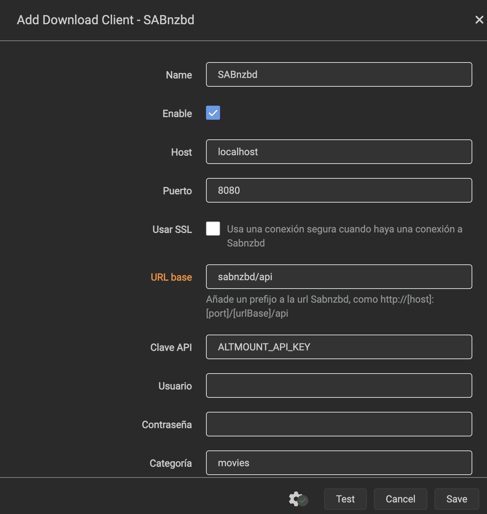

# ARR Integration (Radarr/Sonarr)

AltMount provides seamless integration with Radarr, Sonarr, and other ARR applications, enabling automated media management with Usenet streaming capabilities. This guide covers setup and configuration for optimal integration.

## Overview

AltMount integrates with ARR applications through:

- **SABnzbd-Compatible API**: Drop-in replacement for existing SABnzbd configurations
- **Repair Service**: Automatic triggering of re-downloads for unhealthy files via ARR applications
- **Health Integration**: Seamless coordination with health monitoring for file validation
- **WebDAV Access**: Direct streaming access to downloaded content

_[Screenshot placeholder: Architecture diagram showing AltMount connected to Radarr, Sonarr, and other ARR applications]_

## SABnzbd Compatibility

AltMount acts as a drop-in replacement for SABnzbd, providing a compatible API that ARR applications can use as their download client. This integration enables seamless automated media management with Usenet streaming capabilities.

### How AltMount Works as SABnzbd Download Manager

When configured as a SABnzbd download client, AltMount follows this process:

1. **ARR sends NZB to AltMount**: The ARR application (Radarr/Sonarr) identifies content to download and sends the NZB file to AltMount via the SABnzbd-compatible API endpoint
2. **AltMount imports and notifies**: AltMount processes the NZB file, imports the content into its system, and notifies the rclone cache to update the mounted folder structure
3. **ARR picks up and moves**: The ARR application detects the imported file in the WebDAV mount and moves it to the final destination directory according to its library configuration

This process enables AltMount to handle Usenet downloading while ARR applications manage media organization and library structure.

### Basic SABnzbd API Setup

Enable the SABnzbd-compatible API through the AltMount web interface:


_SABnzbd-compatible API configuration in the AltMount web interface_

**Configuration Steps:**

1. **Enable SABnzbd API**: Check the enabled checkbox to activate the API
2. **Mount Directory**: Set where WebDAV will be mounted (use `/mnt/unionfs` if using unionfs)
3. **Categories**: Configure download categories for different media types:
   - **movies**: For movie downloads (order: 1, priority: 0)
   - **tv**: For TV show downloads (order: 2, priority: 0)
   - **music**: For music downloads (order: 3, priority: 0)

### ARR Application Configuration

Configure your ARR applications to use AltMount as their download client:

import Tabs from '@theme/Tabs';
import TabItem from '@theme/TabItem';

<Tabs>
<TabItem value="radarr" label="Radarr" default>

**Download Client Settings:**

- **Name**: `AltMount`
- **Type**: `SABnzbd`
- **Host**: `localhost` (or AltMount server IP)
- **Port**: `8080`
- **URL Base**: `sabnzbs/api`
- **API Key**: `AltMountApiKey` (The api key of your altmount instance that you can find in the system settings.)
- **Category**: `movies`
- **Recent Priority**: `Default`
- **Older Priority**: `Default`

</TabItem>
<TabItem value="sonarr" label="Sonarr">

**Download Client Settings:**

- **Name**: `AltMount`
- **Type**: `SABnzbd`
- **Host**: `localhost` (or AltMount server IP)
- **Port**: `8080`
- **URL Base**: `sabnzbs/api`
- **API Key**: `AltMountApiKey` (The api key of your altmount instance that you can find in the system settings.)
- **Category**: `tv`
- **Recent Priority**: `Default`
- **Older Priority**: `Default`

</TabItem>
</Tabs>


_Configuring AltMount as download client in ARR applications_

### Mount Path Configuration - Critical for Success

The mount path is the most critical setting for ARR integration. It must be set to the exact path where your ARR applications see the WebDAV-mounted AltMount files:

```yaml
arrs:
  enabled: true
  mount_path: "/mnt/altmount" # Path where ARRs see WebDAV files
```

**Mount Path Examples:**

| Deployment Method  | ARR Mount Path  | ARR Library Path        | Notes               |
| ------------------ | --------------- | ----------------------- | ------------------- |
| **Docker Compose** | `/downloads`    | `/downloads/movies/`    | Shared volume mount |
| **Linux rclone**   | `/mnt/altmount` | `/mnt/altmount/movies/` | rclone WebDAV mount |
| **UnionFS**        | `/mnt/unionfs`  | `/mnt/unionfs/movies/`  | UnionFS with WebDAV |

**Why Mount Path Matters:**

When AltMount reports file paths to ARR applications for repair, it must use paths that ARRs can access. If the mount path is wrong, ARRs cannot find files to repair:

```
❌ Wrong: mount_path="/metadata" (AltMount local path)
✅ Correct: mount_path="/mnt/altmount" (ARR WebDAV mount path)
```

## Next Steps

With ARR integration configured:

1. **[Optimize Performance](streaming.md)** - Fine-tune for your usage patterns

---
