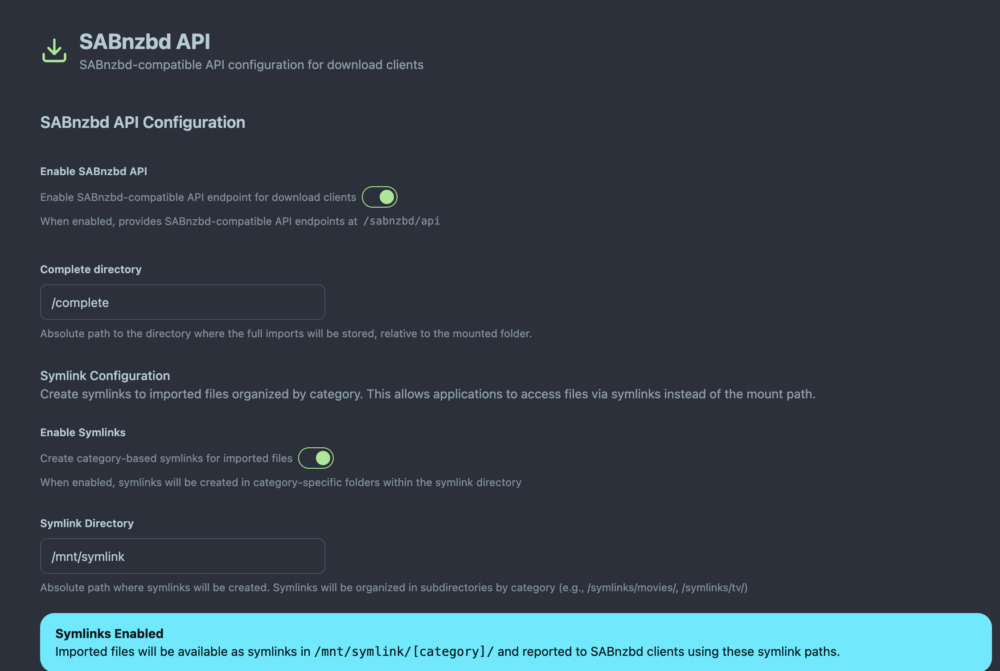

# ARR Integration (Radarr/Sonarr)

AltMount provides seamless integration with Radarr, Sonarr, and other ARR applications, enabling automated media management with Usenet streaming capabilities. This guide covers setup and configuration for optimal integration.

## Overview

AltMount integrates with ARR applications through:

- **SABnzbd-Compatible API**: Drop-in replacement for existing SABnzbd configurations
- **Repair Service**: Automatic triggering of re-downloads for unhealthy files via ARR applications
- **Health Integration**: Seamless coordination with health monitoring for file validation
- **WebDAV Access**: Direct streaming access to downloaded content

_[Screenshot placeholder: Architecture diagram showing AltMount connected to Radarr, Sonarr, and other ARR applications]_

## SABnzbd Compatibility

AltMount acts as a drop-in replacement for SABnzbd, providing a compatible API that ARR applications can use as their download client. This integration enables seamless automated media management with Usenet streaming capabilities.

### How AltMount Works as SABnzbd Download Manager

When configured as a SABnzbd download client, AltMount follows this process:

1. **ARR sends NZB to AltMount**: The ARR application (Radarr/Sonarr) identifies content to download and sends the NZB file to AltMount via the SABnzbd-compatible API endpoint
2. **AltMount imports and notifies**: AltMount processes the NZB file, imports the content into its system, and notifies the rclone cache to update the mounted folder structure
3. **ARR picks up and moves**: The ARR application detects the imported file in the WebDAV mount and moves it to the final destination directory according to its library configuration

This process enables AltMount to handle Usenet downloading while ARR applications manage media organization and library structure.

### Basic SABnzbd API Setup

Enable the SABnzbd-compatible API through the AltMount web interface:


_SABnzbd-compatible API configuration in the AltMount web interface_

**Configuration Steps:**

1. **Enable SABnzbd API**: Check the enabled checkbox to activate the API
2. **Complete Directory**: Set where WebDAV will be mounted (use `/mnt/unionfs/altmount/completed` if using unionfs)
3. **Categories**: Configure download categories for different media types:
   - **movies**: For movie downloads (order: 1, priority: 0)
   - **tv**: For TV show downloads (order: 2, priority: 0)
   - **music**: For music downloads (order: 3, priority: 0)

### Symlink Configuration (Advanced)

AltMount can create category-based symlinks for imported files, providing an alternative access method for applications that require filesystem paths. This is particularly useful when ARR applications need direct filesystem access instead of WebDAV mounts.

#### When to Use Symlinks

**Use symlinks when:**

- Your ARR applications have issues with WebDAV mounts
- You need a clean category-based directory structure
- You want files organized by category without moving them from metadata storage
- Your setup uses containerized ARRs with specific volume mappings

**Traditional WebDAV mount is sufficient when:**

- ARRs can mount WebDAV successfully
- You prefer the simplicity of a single mount point
- Network filesystems work well in your environment

#### Symlink Structure

When symlinks are enabled, AltMount creates symbolic links organized by category:

```
/symlinks/                    # Your configured symlink directory
├── movies/                   # Movies category folder
│   ├── Movie.2023.mkv       -> /mnt/altmount/completed/movies/Movie.2023.mkv
│   └── Another.Movie.mkv    -> /mnt/altmount/completed/movies/Another.Movie.mkv
├── tv/                       # TV shows category folder
│   ├── Show.S01E01.mkv      -> /mnt/altmount/completed/tv/Show.S01E01.mkv
│   └── Show.S01E02.mkv      -> /mnt/altmount/completed/tv/Show.S01E02.mkv
└── default/                  # Default category for uncategorized imports
    └── file.mkv             -> /mnt/altmount/completed/default/file.mkv
```

**Key Concepts:**

- **Category folders**: Each configured category gets its own subdirectory
- **Symbolic links**: Files are symlinked, not copied or moved
- **Target**: Symlinks point to the actual files in the WebDAV mount/metadata path
- **Path reporting**: When symlinks are enabled, AltMount reports symlink paths to ARR applications

#### Configuration Steps

Enable and configure symlinks through the SABnzbd configuration interface:


_Symlink configuration in the SABnzbd settings showing enable toggle and directory path_

**Configuration Options:**

1. **Enable Symlinks**: Toggle to activate symlink creation
2. **Symlink Directory**: Absolute path where category folders and symlinks will be created
   - Must be an absolute path (e.g., `/symlinks`, `/mnt/altmount-symlinks`)
   - Directory will be created automatically if it doesn't exist
   - Must be writable by the AltMount process

**YAML Configuration Example:**

```yaml
sabnzbd:
  enabled: true
  complete_dir: "/mnt/altmount/completed"
  symlink_enabled: true
  symlink_dir: "/symlinks"
  categories:
    - name: "movies"
      order: 1
      priority: 0
      dir: "movies" # Category subdirectory name
    - name: "tv"
      order: 2
      priority: 0
      dir: "tv"
```

#### How Sonarr/Radarr Use Symlinks

When symlinks are enabled, the import workflow changes to use symlink paths:

**Import Workflow:**

1. **ARR sends NZB**: Radarr/Sonarr identifies content and sends NZB to AltMount with category (e.g., "movies")
2. **AltMount imports**: AltMount processes the NZB and imports the file to metadata storage
3. **Symlink created**: AltMount creates a symlink in `/symlinks/movies/Movie.2023.mkv`
4. **ARR notified**: AltMount reports the path as `/symlinks/movies/Movie.2023.mkv` (symlink path, not mount path)
5. **ARR imports**: Radarr/Sonarr sees the file at the symlink location and moves/hardlinks it to the final library location

**Path Reporting Behavior:**

| Symlinks Enabled | Path Reported to ARR                       | Actual File Location                                     |
| ---------------- | ------------------------------------------ | -------------------------------------------------------- |
| ❌ No            | `/mnt/altmount/completed/movies/Movie.mkv` | `/mnt/altmount/completed/movies/Movie.mkv`               |
| ✅ Yes           | `/symlinks/movies/Movie.mkv`               | `/mnt/altmount/completed/movies/Movie.mkv` (via symlink) |

**Sonarr will see:**

- Download completes at: `/downloads/tv/Show.S01E01.mkv`
- Moves to library: `/tv/Show Name/Season 01/Show.S01E01.mkv`

##### Linux Bare-Metal Setup

```yaml
# AltMount configuration
sabnzbd:
  complete_dir: "/symlinks"
  symlink_enabled: true
  symlink_dir: "/symlinks"

mount_path: "/symlinks" # For health monitoring path reporting

# Sonarr/Radarr configuration
# - Host: localhost:8080
# - Category: tv or movies
# - Remote Path Mappings: /symlinks -> /symlinks
```

**Directory Structure:**

```
/metadata/                      # AltMount metadata storage
  └── completed/
      ├── movies/Movie.mkv
      └── tv/Show.mkv

/symlinks/                      # Symlink directory
  ├── movies/
  │   └── Movie.mkv -> /metadata/completed/movies/Movie.mkv
  └── tv/
      └── Show.mkv -> /metadata/completed/tv/Show.mkv

/media/                         # Final ARR library
  ├── movies/Movie.mkv
  └── tv/Show.mkv
```

#### Best Practices

**Permissions:**

- Ensure the symlink directory is writable by AltMount
- Ensure ARR applications can read from the symlink directory
- In Docker, use appropriate user/group permissions

**Path Accessibility:**

- Symlink directory must be accessible from both AltMount and ARR containers
- Use shared volumes in Docker Compose
- Verify symlink targets are resolvable from ARR's perspective

**Category Configuration:**

- Configure categories before enabling symlinks
- Category names should match ARR categories (e.g., "movies", "tv")
- Use the "dir" field to customize subdirectory names

#### Troubleshooting

**Symlinks not created:**

- Check AltMount logs for permission errors
- Verify symlink directory path is absolute
- Ensure directory exists and is writable

**ARR cannot find files:**

- Verify symlink directory is mounted in ARR container
- Check that symlink targets are resolvable (use `ls -l` to check symlinks)
- Confirm category names match between AltMount and ARR configuration

**Symlinks break after restart:**

- Check that both symlink directory and target paths are mounted consistently
- Verify Docker volume configurations persist across restarts
- Use absolute paths in configuration

**Permission denied errors:**

- Ensure AltMount process has write permission to symlink directory
- In Docker, match user/group IDs between containers
- Check that ARR can read from the symlink directory

### ARR Application Configuration

Configure your ARR applications to use AltMount as their download client:

import Tabs from '@theme/Tabs';
import TabItem from '@theme/TabItem';

<Tabs>
<TabItem value="radarr" label="Radarr" default>

**Download Client Settings:**

- **Name**: `AltMount`
- **Type**: `SABnzbd`
- **Host**: `localhost` (or AltMount server IP)
- **Port**: `8080`
- **URL Base**: `sabnzbd/api`
- **API Key**: `AltMountApiKey` (The api key of your altmount instance that you can find in the system settings.)
- **Category**: `movies`
- **Recent Priority**: `Default`
- **Older Priority**: `Default`

</TabItem>
<TabItem value="sonarr" label="Sonarr">

**Download Client Settings:**

- **Name**: `AltMount`
- **Type**: `SABnzbd`
- **Host**: `localhost` (or AltMount server IP)
- **Port**: `8080`
- **URL Base**: `sabnzbd/api`
- **API Key**: `AltMountApiKey` (The api key of your altmount instance that you can find in the system settings.)
- **Category**: `tv`
- **Recent Priority**: `Default`
- **Older Priority**: `Default`

</TabItem>
</Tabs>


_Configuring AltMount as download client in ARR applications_

### Mount Path Configuration - Critical for Success

The mount path is the most critical setting for ARR integration. It must be set at the **root config level** to the exact path where your ARR applications see the WebDAV-mounted AltMount files:

```yaml
# Root-level configuration (not under arrs)
mount_path: "/mnt/altmount" # Path where ARRs see WebDAV files

arrs:
  enabled: true
  max_workers: 5
  radarr_instances:
    - name: "radarr-main"
      url: "http://localhost:7878"
      api_key: "your-api-key"
      enabled: true
```

**Mount Path Examples:**

| Deployment Method  | mount_path Value | ARR Library Path        | Notes                 |
| ------------------ | ---------------- | ----------------------- | --------------------- |
| **Docker Compose** | `/downloads`     | `/downloads/movies/`    | Shared volume mount   |
| **Linux rclone**   | `/mnt/altmount`  | `/mnt/altmount/movies/` | rclone WebDAV mount   |
| **Built-in Mount** | `/mnt/altmount`  | `/mnt/altmount/movies/` | AltMount rclone mount |
| **UnionFS**        | `/mnt/unionfs`   | `/mnt/unionfs/movies/`  | UnionFS with WebDAV   |

**Why Mount Path Matters:**

When AltMount reports file paths to ARR applications for repair, it must use paths that ARRs can access. If the mount path is wrong, ARRs cannot find files to repair:

```
❌ Wrong: mount_path="/metadata" (AltMount local metadata path)
❌ Wrong: mount_path="/config/metadata" (Docker internal path)
✅ Correct: mount_path="/mnt/altmount" (ARR's WebDAV mount path)
```

**Configuration Location:**

The `mount_path` is at the **root level** of the config file, **not inside the arrs section**. This is because the mount path is a system-wide setting used across multiple components.

## Next Steps

With ARR integration configured:

1. **[Optimize Performance](streaming.md)** - Fine-tune for your usage patterns

---
