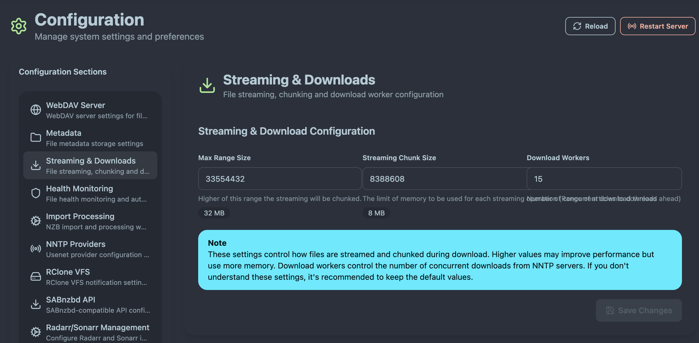

# Streaming Configuration

AltMount's streaming capabilities allow direct media playback from Usenet without waiting for complete downloads. This guide covers optimizing streaming performance for your specific setup and use cases.

## Overview

The streaming system provides:

- **Range Request Support**: Efficient seeking and partial downloads
- **Concurrent Workers**: Parallel downloads for faster streaming
- **Intelligent Caching**: Smart prefetching for smooth playback
- **Adaptive Performance**: Configuration tuning for different scenarios

## Basic Streaming Configuration

### Default Settings

Configure streaming parameters through the System Configuration interface:

_Streaming settings in the system configuration showing performance parameters_

AltMount includes reasonable defaults that work for most setups:

- **Max Range Size**: 32MB (33554432 bytes) - Maximum single range request
- **Streaming Chunk Size**: 8MB (8388608 bytes) - Size of streaming chunks
- **Max Download Workers**: 15 - Number of concurrent download workers

On higher values you can see the performance improvement but also the memory usage will be higher.

## Next Steps

With streaming optimized:

1. **[Configure ARR Integration](integration.md)** - Set up automated downloads
2. **[Set up Health Monitoring](../3. Configuration/health-monitoring.md)** - Monitor performance

---

For advanced streaming scenarios and troubleshooting, see the [Troubleshooting Guide](../5.%20Troubleshooting/performance.md).
